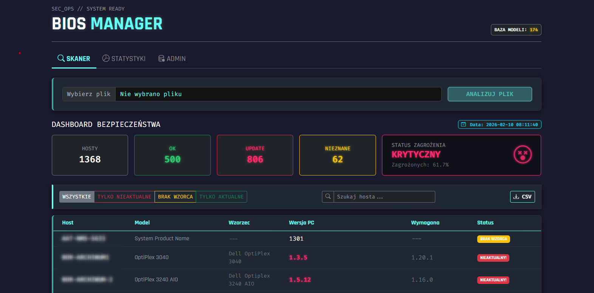
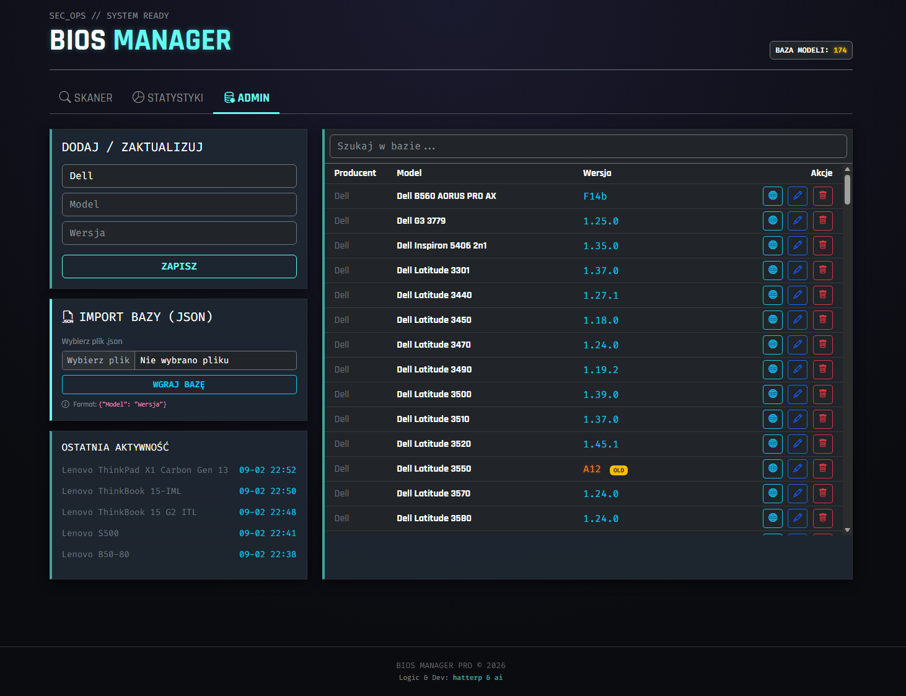

# 🛡️ BIOS Manager Pro

**Zaawansowany Dashboard SecOps do analizy i monitorowania wersji BIOS w środowisku korporacyjnym.**

Narzędzie SecOps oparte na Flask i Pandas do automatycznej analizy zgodności wersji BIOS w infrastrukturze IT. Oferuje import danych z CSV/XLSX, ocenę ryzyka, wizualizację statystyk (Heatmap) oraz panel administracyjny z obsługą bazy JSON/SQL.

Aplikacja rozwiązuje problem ręcznego weryfikowania wersji oprogramowania układowego (BIOS/UEFI) na setkach komputerów. Pozwala na wgranie raportu z inwentaryzacji (Excel/CSV), automatycznie porównuje wersje z wewnętrzną bazą wiedzy i generuje raport bezpieczeństwa z oceną ryzyka.

Baza wzorców (bios_versions.json) aktualna na dzień 10.02.2026. Najwięcej wzorców dotyczy urządzeń marki Dell.


## 🚀 Główne Funkcjonalności

### 1. Skaner i Analiza
* **Import Danych:** Obsługa plików `.xlsx` oraz `.csv` (np. z SCCM, Lansweeper, OCS Inventory).
* **Inteligentne Parsowanie:** Algorytmy Regex (`packaging.version`) radzące sobie z różnymi formatami wersji (np. "1.20", "A14", "Ver 1.0 (A03)").
* **Risk Score:** Automatyczne obliczanie poziomu zagrożenia organizacji (od "Bunkier" do "Krytyczny").



### 2. Wizualizacja Danych (Cyberpunk UI)
* **Heatmapa Oddziałów:** Wizualna reprezentacja zgodności w poszczególnych lokalizacjach firmy.
* **Wykresy:** Status aktualizacji (OK / Outdated / Unknown).
* **Ranking:** Lista oddziałów posortowana od najmniej bezpiecznych.
* **Nowoczesny Design:** Ciemny motyw z neonowymi akcentami (Bootstrap 5 + Custom CSS).

### 3. Panel Administratora
* **Baza Wiedzy:** Zarządzanie wzorcami wersji BIOS (SQLAlchemy + SQLite).
* **Import/Eksport:** Możliwość szybkiego zasilenia bazy plikiem JSON (`import_json_db`).
* **Edycja:** Oznaczanie modeli jako "OLD" (brak wsparcia producenta).
* 


## 🛠️ Technologie

* **Backend:** Python 3.10+, Flask
* **Baza Danych:** SQLite + SQLAlchemy
* **Analiza Danych:** Pandas, OpenPyXL
* **Frontend:** HTML5, Jinja2, Bootstrap 5, Chart.js
* **Style:** Custom CSS (Neon/Dark Mode)

## ⚙️ Instalacja i Uruchomienie

1. **Sklonuj repozytorium:**
   ```bash
   git clone [https://github.com/phatterit/bios-manager-pro.git](https://github.com/phatterit/bios-manager-pro.git)
   cd bios-manager-pro

Utwórz i aktywuj wirtualne środowisko:
 

    python -m venv venv

    # Windows:
    venv\Scripts\activate

    # Linux/Mac:
    source venv/bin/activate

Zainstaluj zależności:
  

    pip install -r requirements.txt

Uruchom aplikację:
 

    python app.py

Aplikacja otworzy się automatycznie w przeglądarce pod adresem http://127.0.0.1:5000.

### 📂 Struktura Projektu

    app.py - Główny plik aplikacji, routing i widoki.

    logic.py - Logika biznesowa, parsowanie plików, obliczanie statystyk.

    models.py - Modele bazy danych (SQLAlchemy).

    templates/ - Pliki HTML (Jinja2).

    static/ - Pliki CSS i JS.

    bios_versions.json - Plik pomocniczy do synchronizacji bazy wiedzy.

### 📝 Autor

Logic & Dev: hatterp & AI Support.

Projekt stworzony w celach edukacyjnych, wzrostu bezpieczeństwa ogranizacji oraz usprawnienia procesów Security Operations.
